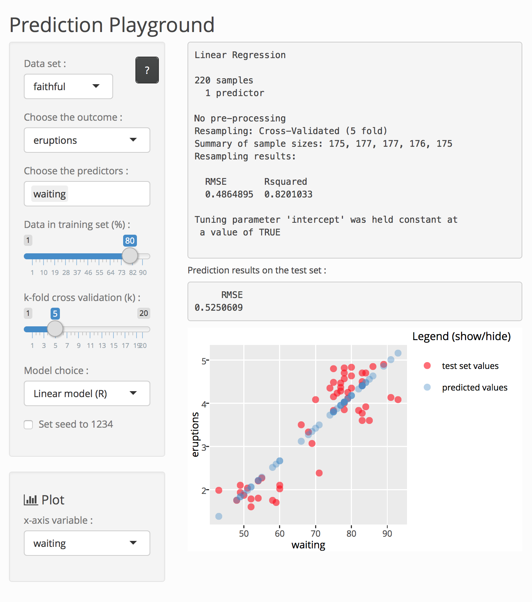
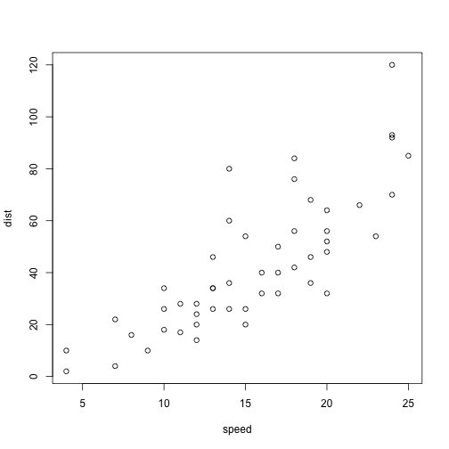

<style>

/* slide titles */
.reveal h3 { 
  font-size: 45px;
  color: black;
}

/* heading for slides with two hashes ## */
.reveal .slides section .slideContent h2 {
   font-size: 35px;
   font-weight: bold;
   color: #25679E;
}

/* heading for slides with four hashes #### */
.reveal .slides section .slideContent h4 {
   font-size: 25px;
   color: #25679E;
}

/* ordered and unordered list styles */
.reveal ul {
    font-size: 25px;
    list-style-type: square;
}

.reveal ol {
    font-size: 25px;
    line-height: 0.2em;
}

.reveal p {
    font-size: 23px;
    list-style-type: square;
}

.reveal small {
	font-size: 0.75em;
}

.reveal strong {
  #color: #25679E;
  color : black;
}

.reveal pre code {
  display: block; padding: 0.5em;
  font-size: 0.8em;
  line-height: 1.1em;
  background-color: white;
  overflow: visible;
  max-height: none;
  word-wrap: normal;
}

.reveal code {
  font-size: 0.9em;
  background-color: #f8f8f8;
  color : #b11d42;
}

.section .reveal h1 {
   font-size: 1.5em;
   line-height: 1.5em;     
}

.section .reveal p {
   font-size: 0.7em;
   line-height: 1.5em;     
}

.section .reveal .state-background {
   background: #25679E;
}

.reveal .controls div.navigate-left,
.reveal .controls div.navigate-left.enabled {
  border-right-color: #a9d4f8;
}

.reveal .controls div.navigate-right,
.reveal .controls div.navigate-right.enabled {
  border-left-color: #a9d4f8;
}

</style>

Developing Data Products course project : Prediction Playground
========================================================
author: Romain Faure
date: April 2017


A PEDAGOGICAL PROJECT
========================================================

## Introducing *Prediction Playground*

Started from the wish to be able to actually *play* with **machine learning** concepts and models in an interactive manner in order to develop understanding and intuition - hence the idea of a *"playground"*.     

The idea is to be able to quickly apply different prediction models to different data sets, splitting the data into training and test sets, choosing the outcome and the predictors, building the model and finally evaluate the accuracy of the model predictions. The application interface makes possible to **learn** by seeing how changing parameters affect the resulting predictions. And like in every playground, errors can happen and are part of the experience-based learning process.

Link to the app : https://cdromain.shinyapps.io/prediction_playground/

## A triple pedagogical purpose

1. This project allowed me to learn how to develop a web application using [Shiny](https://shiny.rstudio.com/) reactive framework in RStudio.</small>

2. Developing the app gave me an opportunity to learn more about **machine learning** fundamental concepts and models.

3. *Playing* with the app enabled me to deepen my understanding and intuitions regarding machine learning concepts (which was the initial goal) - hopefully, the app will benefit others in the same way.


DATA SELECTION AND MODEL BUILDING
========================================================


#### 1. Select a data set
<small>*Click on the ? button to get more info about the selected data set.*</small>

#### 2. Choose the outcome variable

#### 3. Choose the predictors variables
<small>*Default = all, except the outcome variable (which is automatically removed from the list).*</small>

#### 4. Partition the data using the slider
<small>*This % gets assigned to the training set while the remaining data goes to the test set.*</small>

#### 5. Choose k for k-fold cross-validation using the slider
<small>*Choose 1 to disable C.V.*</small>

#### 6. Choose the prediction model
<small>*The chosen model will be trained and then used for prediction. "C" means classification only and "R" regression only.*</small>

#### 7. Optionally set the seed to 1234
<small>*The seed concerns both data partitioning and model building for reproducibility purposes.*</small>

***



RESULTS AND MODEL EVALUATION
========================================================

## Numerical output

## Plot


```r
plot(cars)
```



*INCLUDE AND SHOW R CALCULATION code as an example*


CLOSING WORDS
========================================================

## Possible improvements

- Add more data sets and models.
- Add the possibility to tune specific models parameters (e.g. `ntree` and `mtry` for random forests).
- Add the possibility to compare two models (for example using tabs).

## Credits

- This app is powered and made possible by the [`caret`](https://topepo.github.io/caret/) package and its interface unifying different predictive algorithms.

- The interactive plot displayed both in the application and this presentation is powered by the [`plotly`](https://cran.r-project.org/web/packages/plotly/index.html) package and [graphing library](https://plot.ly/r/).

- This HTML5 reproducible pitch presentation was created in RStudio version 1.0.136 (R version 3.3.3, OSX 10.11.6) using the [R Presentation](https://support.rstudio.com/hc/en-us/articles/200486468-Authoring-R-Presentations) format with custom CSS (added inside the `.Rpres` file, available on the presentation [GitHub repo](https://github.com/cdromain/DevDataProd_ProjectPres)), for the *Developing Data Products* course project, part of the Johns Hopkins Data Science Specialization on [Coursera](http://coursera.org/).
