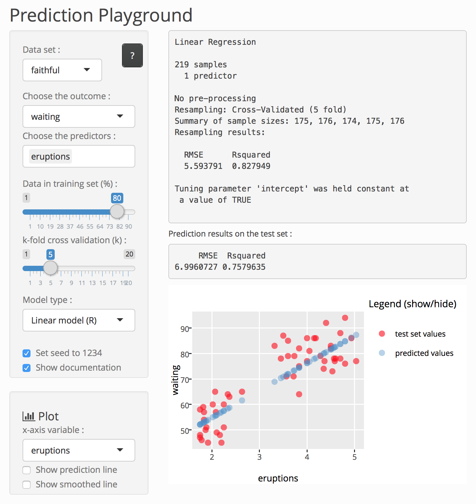

<style>

/* slide titles */
.reveal h3 { 
  font-size: 45px;
  color: black;
}

/* heading for slides with two hashes ## */
.reveal .slides section .slideContent h2 {
   font-size: 35px;
   font-weight: bold;
   color: #25679E;
}

/* heading for slides with four hashes #### */
.reveal .slides section .slideContent h4 {
   font-size: 25px;
   color: #25679E;
}

/* ordered and unordered list styles */
.reveal ul {
    font-size: 25px;
    list-style-type: square;
    line-height: 0.2em;
}

.reveal ol {
    font-size: 25px;
}

.reveal p {
    font-size: 23px;
    list-style-type: square;
}

.reveal small {
	font-size: 0.75em;
}

.reveal strong {
  #color: #25679E;
  color : black;
}

.reveal pre code {
  display: block; padding: 0.5em;
  font-size: 0.8em;
  line-height: 1.1em;
  background-color: white;
  overflow: visible;
  max-height: none;
  word-wrap: normal;
}

.reveal code {
  font-size: 0.9em;
  background-color: #f8f8f8;
  color : #b11d42;
}

.section .reveal h1 {
   font-size: 1.3em;
   line-height: 1.5em;     
}

.section .reveal p {
   font-size: 0.7em;
   line-height: 1.5em;     
}

.section .reveal .state-background {
   background: #25679E;
}

.reveal .controls div.navigate-left,
.reveal .controls div.navigate-left.enabled {
  border-right-color: #a9d4f8;
}

.reveal .controls div.navigate-right,
.reveal .controls div.navigate-right.enabled {
  border-left-color: #a9d4f8;
}

</style>

DEVELOPING DATA PRODUCTS course project : Prediction Playground
========================================================
author: Romain Faure
date: April 2017


A PEDAGOGICAL PROJECT
========================================================

## Introducing *Prediction Playground*

Started from the wish to be able to actually *play* with **machine learning** concepts and models in an interactive manner, in order to develop understanding and intuition - hence the idea of a *"playground"*.     

The idea is to be able to quickly apply different prediction models to different data sets, splitting the data into training and test sets, choosing the outcome and the predictors, building the model and finally evaluate the accuracy of the model predictions. The application interface makes it possible to **learn** by seeing how changing parameters affect the resulting predictions accuracy. And like in every playground, errors can happen and are part of such an **experience-based** learning process.

Link to the app : https://cdromain.shinyapps.io/prediction_playground/

## A triple pedagogical purpose

1. This project allowed me to learn how to develop a web application using [Shiny](https://shiny.rstudio.com/) reactive framework in RStudio.</small>

2. Developing the app gave me an opportunity to review and learn more about **machine learning** fundamental concepts and models.

3. *Playing* with the app enabled me to deepen my understanding and intuitions regarding machine learning concepts (which was the initial goal) - hopefully, the app can benefit others in the same way.


DATA SELECTION AND MODEL BUILDING
========================================================


#### 1. Select a data set
<small>*Click on the ? button to get more info about the selected data set.*</small>

#### 2. Choose the outcome variable

#### 3. Choose the predictors variables
<small>*Default = all, except the outcome variable (which is automatically removed from the list).*</small>

#### 4. Partition the data using the first slider
<small>*This % gets assigned to the training set while the remaining data goes to the test set.*</small>

#### 5. Choose k for k-fold cross-validation using the second slider
<small>*Choose 1 to disable C.V.*</small>

#### 6. Choose the prediction model
<small>*The chosen model will be trained and then used for prediction on the test set. "C" means classification only and "R" regression only.*</small>

#### 7. Optionally set the seed to 1234
<small>*The seed concerns both data partitioning and model building for reproducibility purposes.*</small>

***



RESULTS AND MODEL EVALUATION
========================================================

Here is an example of the application output, using the `faitful` data set and a linear model with 5-fold cross-validation ($80\%$ of the data in the training set and $20\%$ in the test set), predicting on the test set :

<small>*(Note : the code that was evaluated to generate the output below is available on the presentation [GitHub repo](https://github.com/cdromain/DevDataProd_ProjectPres))*</small>

## Prediction accuracy measures


```
     RMSE  Rsquared 
6.9960727 0.7579635 
```

## Interactive Plotly plot
<iframe src="plotly.html" style="position:absolute;height:50%;width:55%"></iframe>


CLOSING WORDS
========================================================

## Future improvements

- More models. Boosting, bagging and model ensembling.

- Add the possibility to tune specific model parameters (e.g. `ntree` and `mtry` for random forests).

- Add tabs to compare models outputs and display different evaluation/diagnosis plots.

## Credits

- The *Prediction Playground* [Shiny](https://shiny.rstudio.com/) web application is powered and made possible by the [`caret`](https://topepo.github.io/caret/) package and its interface unifying different predictive algorithms. The interactive plot displayed both in the app and this presentation is powered by the [`plotly`](https://cran.r-project.org/web/packages/plotly/index.html) package and [graphing library](https://plot.ly/r/). Several other packages were used for data sets and predictive models (see the complete list in the `server.R` file in the app [GitHub repo](https://github.com/cdromain/DevDataProd_ProjectApp)).

- This HTML5 reproducible pitch presentation was created using the [R Presentation](https://support.rstudio.com/hc/en-us/articles/200486468-Authoring-R-Presentations) format with custom CSS (added inside the `.Rpres` file, available on the presentation [GitHub repo](https://github.com/cdromain/DevDataProd_ProjectPres)).

- Both the presentation and the app were created for the *Developing Data Products* course project, part of the Johns Hopkins Data Science Specialization on [Coursera](http://coursera.org/), using RStudio version 1.0.136 (R version 3.3.3, OSX 10.11.6) in April 2017.
